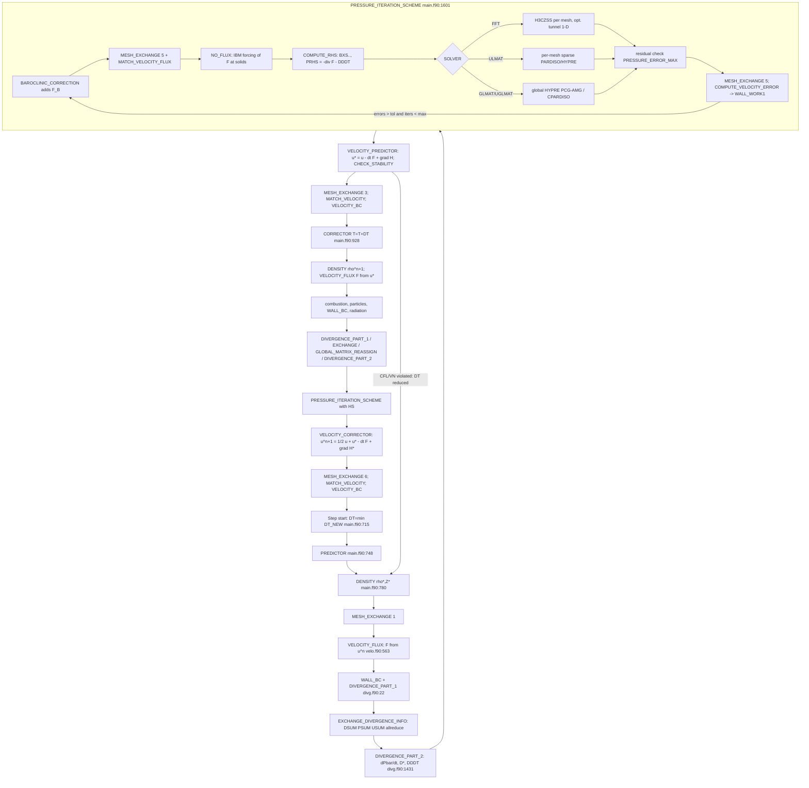

# 00 — FDS pressure / divergence / velocity-correction baseline

**Status:** Draft v1. Author role: numerical analyst (pressure/projection).
**Source baseline (re-based 2026-09-25):** FireX branch `AMReX`, commit `36975d765fcead401e14b094a04f910ac42eab8a`
(`Merge pull request #16596 from cxp484/FireX`, 2026-09-24), checked out read-only at this repository. `git status` is
clean. **All `file:line` citations in this file refer to this repository at `36975d765f`.**
The earlier draft cited firemodels master `ce1f659` (`(local FDS master checkout)`). Every citation was re-mapped mechanically through
`git diff -U0 ce1f659 36975d765f` hunks, and each mapped line was checked for identical text on both bases. The three lines
that fell inside changed hunks were re-located by hand. What FireX changes in the pressure path is summarised in §11.

Citation convention: `pres.f90:233-310` means `Source/pres.f90`, lines 233–310. Manuals are cited as
`TechGuide/Momentum_Chapter.tex:347-383` (= `Manuals/FDS_Technical_Reference_Guide/…`) and
`UserGuide/FDS_User_Guide.tex:9439-9498`.

---

## 0. Assumptions and scope of this inventory

1. This is a description of the **gas-phase, Cartesian, non-cylindrical** path. Cylindrical (2-D axisymmetric) branches
   exist in the same routines (e.g. `pres.f90:236-247`) but are not treated in detail.
2. The complex-geometry cut-cell path (`CC_IBM`, `ccib.f90`, `geom.f90`) is inventoried only where it touches the pressure
   solve (hooks in `main.f90:1615-1621`, `main.f90:1634`, `main.f90:1648`, `main.f90:1691`). Its internals are out of scope for this first spec.
3. Level-set/wildfire-only mode (`LEVEL_SET_MODE==1`) skips the pressure solve (`main.f90:855`, `main.f90:1090`) and is ignored.
4. "Mesh" means an FDS `&MESH` block (a rectilinear, possibly stretched, block owning its own arrays); "interface" means an
   FDS `INTERPOLATED_BOUNDARY` between two meshes.
5. Where the Tech Guide and the code differ, the code at `36975d765f` is authoritative; differences are flagged. The Tech Guide
   sources are identical on both bases. The User Guide differs only in unrelated sections (output quantities, STL).

---

## 1. Governing formulation: the H ("stagnation energy") form

### 1.1 Continuous form (Tech Guide)

The Tech Guide derives the momentum equation used by FDS (`TechGuide/Momentum_Chapter.tex:263-285`):

* subtract hydrostatic background, `∇p = ρ0(z) g + ∇p̃` (line 275);
* use `(u·∇)u = ∇|u|²/2 − u×ω` (line 276);
* divide by ρ and decompose `(1/ρ)∇p̃ = ∇(p̃/ρ) − p̃ ∇(1/ρ)` (line 279);
* define **`H ≡ |u|²/2 + p̃/ρ`** (line 280).

Result (Eq. `momeq`, line 284):

```
∂u/∂t + F_A + F_B + ∇H = 0,
F_A = −u×ω − (1/ρ)[(ρ−ρ0) g + f_b + ∇·τ]      (advective/viscous/buoyancy)
F_B = −p̃ ∇(1/ρ)                                  (baroclinic torque)
```

Taking the divergence gives the Poisson equation (Eq. `pe`, `Momentum_Chapter.tex:350-353`):
`∇²H = −∂(∇·u)/∂t − ∇·(F_A + F_B)`. The Tech Guide states explicitly (line 354) that p̃ in `F_B` is lagged
("taken from the last computed H") precisely **so that the linear system has constant coefficients (separable) and can be
solved by a direct FFT method**, and that the Poisson equation is re-solved so that old and new p̃ converge.

### 1.2 Discrete form in the code (confirmed)

* **Storage.** `H` and `HS` are cell-centred (`mesh.f90:27-28`, documented as `p̃/ρ + |u|²/2`). Velocities `U,V,W`
  (and starred `US,VS,WS`) are face-centred on a MAC/staggered grid (`TechGuide/Momentum_Chapter.tex:303-307`).
* **Kinetic energy term.** The code uses the *resolved* kinetic energy `KRES = ½(ū²+v̄²+w̄²)` built from face-averaged
  velocities (`velo.f90:283-292`). Pressure is recovered as `p̃ = ρ (H − KRES)` (`velo.f90:3257`, `pres.f90:761`).
  So the operational definition is **H = KRES + p̃/ρ** — consistent with the Tech Guide up to the discrete definition of |u|²/2.
* **Baroclinic term.** `BAROCLINIC_CORRECTION` (`velo.f90:3216-3315`) removes any previously attached `FVX_B` (lines 3233-3237),
  recomputes `p̃ = ρ(H−KRES)` and `1/ρ` (3254-3261) and adds
  `FVX_B = −(p̃_i ρ_{i+1} + p̃_{i+1} ρ_i)/(ρ_i+ρ_{i+1}) · (1/ρ_{i+1} − 1/ρ_i)/δx` to `FVX` (3270-3272; y, z at 3285-3287, 3300-3302).
  This is exactly Tech Guide Eqs. at `Momentum_Chapter.tex:333-343`, chosen so that
  `∇(p̃/ρ) − p̃∇(1/ρ)` reproduces `(1/ρ̄_face)∇p̃` discretely (line 339-343). Default `BAROCLINIC=.TRUE.` (`cons.f90:229`).
* **Poisson RHS.** `PRESSURE_SOLVER_COMPUTE_RHS` (`pres.f90:16-315`) forms, per cell,
  `PRHS = −(FVX_i − FVX_{i−1})/δx − (…)_y − (…)_z − DDDT` (`pres.f90:250-261`; the `IPS` transposes at 265-308 only
  permute indices for the stretched-direction ordering required by Crayfishpak).
  `FVX` already contains `F_A + F_B` and the boundary forcing described in §5.
* **Operator.** The left-hand side is the constant-coefficient 7-point Laplacian on the (possibly stretched) tensor grid;
  the reference check is `pres.f90:736-739` (`CHECK_POISSON`). The *inseparable* (variable-coefficient) residual
  `∇·((1/ρ̄)∇p̃ + ∇K) = −∇·(F−F_B) − dD/dt` is evaluated only as a convergence diagnostic (`pres.f90:747-795`),
  using harmonic-type face density `2/(ρ_i+ρ_{i+1})`, and stored as `PRESSURE_ERROR_MAX` (`pres.f90:792`).
* **Velocity update.** Predictor: `US = U − δt (FVX + (H_{i+1}−H_i)/δx_n)` (`velo.f90:1603-1630`).
  Corrector: `U = ½(U + US − δt(FVX + (HS_{i+1}−HS_i)/δx_n))` (`velo.f90:1723-1751`). I.e. `u = F-projected velocity − δt ∇H`.

**Consequence for AMR (carried into 01):** FDS is a *constant-coefficient* projection with the variable-density effect moved to an
explicitly lagged RHS term (F_B) and converged by outer (pressure) iterations governed by `PRESSURE_TOLERANCE`.

---

## 2. The divergence constraint D and background pressure zones

### 2.1 Where D is computed (`divg.f90`)

`DIVERGENCE_PART_1` (`divg.f90:22-785`) builds the thermodynamic divergence in the "starred" slot during the predictor
(`DP => DS`, `PBAR_P => PBAR_S`, `divg.f90:58-63`) and in `D` during the corrector (`divg.f90:67-70`):

| Contribution | Lines |
|---|---|
| zero D, merge zones if OBST changed | `divg.f90:84-88` |
| species diffusion terms, boundary flux corrections | `divg.f90:113-420` |
| `∇·k∇T`, wall heat flux, `Q_LEAK` | `divg.f90:450-555` (wall correction at 544) |
| `+ q̇''' + q̇_r` | `divg.f90:556-583` (Cartesian at 567) |
| `− u·∇(ρh_s)` | `divg.f90:585-600` |
| multiply by `RTRM = (γ−1)/(γ P̄)`-type factor `GM1OG*R_PBAR(K,IPZ)` | `divg.f90:603-630` (611-613) |
| species advection/`W̄/W_α` terms | `divg.f90:634-662` |
| reaction source `D_SOURCE` | `divg.f90:664-675` |
| **stratification term** `RTRM · w̄ ρ0(z) g_z` (default `STRATIFICATION=.TRUE.`, `cons.f90:217`) | `divg.f90:677-689` |

(There is no variable named `USTRAT` in the source at this commit — `rg USTRAT Source` returns nothing. The stratification
contribution is the `STRATIFICATION` block above.)

### 2.2 Pressure zones and dP̄/dt

* Per-zone integrals are accumulated in `DIVERGENCE_PART_1`: `DSUM += V_c D`, `PSUM += V_c (1/P̄ − RTRM)` over gas cells of
  each `PRESSURE_ZONE` (`divg.f90:727-753`), and `USUM += u_n A` over solid wall faces and cut faces (`divg.f90:757-778`).
  **Cells overlapped by a higher-priority (lower-numbered) mesh are skipped** via `INTERPOLATED_MESH(I,J,K)>0`
  (`divg.f90:734`, `divg.f90:760`); `INTERPOLATED_MESH` is set in `init.f90:1569-1584` when a lower-numbered mesh covers the cell.
  This is FDS's existing analogue of AMR "covered cells" and must be preserved (see 01 §C).
* The three sums are globally reduced (`MPI_ALLREDUCE`) with zone connectivity in `EXCHANGE_DIVERGENCE_INFO`
  (`main.f90:2028-2054`; called at `main.f90:845` and `main.f90:1065`).
* `DIVERGENCE_PART_2` (`divg.f90:1431-1638`): connected zones are relaxed toward a common pressure with time constant
  `PRESSURE_RELAX_TIME` (default 1 s, `cons.f90:698`) by adjusting `USUM` (`divg.f90:1472-1507`); a zone connected to the
  ambient (zone 0) relaxes to `P_0(1)` (`divg.f90:1495-1497`). Then
  **`dP̄/dt = (DSUM − USUM)/PSUM`** per zone (`divg.f90:1517-1521`) and the divergence is corrected
  `D −= (1/P̄ − RTRM) dP̄/dt` (`divg.f90:1523-1545`, formula at 1540).
* `P̄` is advanced in `mass.f90`: predictor `PBAR_S = PBAR + dP̄/dt·δt` (`mass.f90:548`), corrector
  `PBAR = ½(PBAR + PBAR_S + dP̄/dt_S·δt)` (`mass.f90:730`). Initial `PBAR(K,:) = P_0(K)` (`init.f90:1052`).
* Zone connectivity (`CONNECTED_ZONES`) is updated when obstructions open/close (`MERGE_PRESSURE_ZONES`, `divg.f90:1295-1321`).

**Solvability link.** For a sealed zone, `dP̄/dt` is defined exactly so that `∫_zone D dV = ∮ u·n dA` (the discrete
compatibility condition of the Neumann Poisson problem); this is why the integral constraint must be computed over *exactly the
same* set of cells the Poisson operator sees (see 01 §C.4).

### 2.3 Final D fix-ups and dD/dt

* D = 0 in solid cells (`divg.f90:1547-1555`; cut-cell solid at 1557-1570).
* Wall/ghost cells: for solid walls, `D(ghost) −= u_n/δx` (volume generated at walls, `divg.f90:1572-1600`); for
  OPEN/MIRROR/INTERPOLATED boundaries the ghost D is copied from the adjacent gas cell (`divg.f90:1601-1602`).
* **Time derivative** (the actual Poisson source): predictor `DDDT = (D* − ∇·uⁿ)/δt` (`divg.f90:1610-1619`), corrector
  `DDDT = (2Dⁿ⁺¹ − ∇·uⁿ − ∇·u*)/δt` (`divg.f90:1620-1631`), matching `TechGuide/Momentum_Chapter.tex:366-378`.
  Using the *actual discrete* `∇·u` (not the previous D) makes the scheme self-correcting for divergence drift
  (Tech Guide `Momentum_Chapter.tex:379-383`, `536-543`).
* Boundary normal velocities `U_NORMAL_S`/`U_NORMAL` and `DUNDT` (used in Neumann BCs) come from
  `PREDICT_NORMAL_VELOCITY` (`divg.f90:1324-1425`; `DUNDT` at 1408 and 1420).

---

## 3. Time-step structure (`main.f90`)

FDS uses a two-stage explicit predictor–corrector (second-order Runge–Kutta/Heun type) with **one pressure solve
(plus optional iterations) per stage, i.e. at least two per time step**.

| Phase | Action | Lines |
|---|---|---|
| step start | `DT = MINVAL(DT_NEW)` if all meshes want to increase | `main.f90:715` |
| Predictor | `PREDICTOR=.TRUE.` | `main.f90:748-749` |
| | viscosity, mass FD | `main.f90:764-768` |
| | **`CHANGE_TIME_STEP_LOOP`** begins | `main.f90:774` |
| | `DENSITY` (ρ*, Z*) | `main.f90:778-782` |
| | `MESH_EXCHANGE(1)` species/density at interfaces | `main.f90:790` |
| | `VISCOSITY_BC`, **`VELOCITY_FLUX`** (computes F = FVX/FVY/FVZ) | `main.f90:815-823` (819) |
| | `WALL_BC`, **`DIVERGENCE_PART_1`** | `main.f90:835-841` |
| | `EXCHANGE_DIVERGENCE_INFO` (zones) | `main.f90:845` |
| | **`DIVERGENCE_PART_2`** (dP̄/dt, DDDT) | `main.f90:849-851` |
| | **`PRESSURE_ITERATION_SCHEME`** → Hⁿ | `main.f90:855` |
| | **`VELOCITY_PREDICTOR`** (u*, CFL check) | `main.f90:862-864` |
| | instability stop | `main.f90:869-875` |
| | reduce DT and redo loop if any mesh flags `-1` | `main.f90:880-895` |
| | end of loop | `main.f90:897` |
| | `MESH_EXCHANGE(3)` u*, H at interfaces; `MATCH_VELOCITY`; `VELOCITY_BC` | `main.f90:909-922` |
| Corrector | `CORRECTOR=.TRUE.`, `T = T + DT` | `main.f90:928-933` |
| | `CREATE_OR_REMOVE_OBSTRUCTIONS` | `main.f90:942` |
| | mass FD, `DENSITY` (ρⁿ⁺¹) | `main.f90:946-951` |
| | `VELOCITY_FLUX` (F*) | `main.f90:963-971` (967) |
| | combustion, particles, `WALL_BC`, radiation | `main.f90:973-1048` |
| | `DIVERGENCE_PART_1`, `EXCHANGE_DIVERGENCE_INFO` | `main.f90:1052-1065` |
| | `GLOBAL_MATRIX_REASSIGN` (rebuild matrices if OBSTs changed) | `main.f90:1069`, body `main.f90:1806-1835` |
| | `DIVERGENCE_PART_2` | `main.f90:1084-1086` |
| | **`PRESSURE_ITERATION_SCHEME`** → H* | `main.f90:1090` |
| | **`VELOCITY_CORRECTOR`** (uⁿ⁺¹), `CHECK_DIVERGENCE` | `main.f90:1094-1097` |
| | `MESH_EXCHANGE(6)`, `MATCH_VELOCITY`, `VELOCITY_BC` | `main.f90:1105-1128` |

Note: the routine that computes F is called `VELOCITY_FLUX` (`velo.f90:563`), not `COMPUTE_VELOCITY_FLUX`.

### 3.1 CFL / VN and step rejection

* `CHECK_STABILITY` (`velo.f90:3028-3209`) is called from `VELOCITY_PREDICTOR` (`velo.f90:1672`) using the **predicted**
  velocities `US,VS,WS` and `|D*|` (`velo.f90:3059-3080`, CFL norm options at 3066-3071); VN uses `max(D_Z, μ/ρ)` (3118-3145).
* If `CFL<CFL_MAX` and `VN<VN_MAX` keep DT; if well below the minimum, grow by 1.1 (next step) (`velo.f90:3186-3194`);
  otherwise `DT_NEW = 0.9·min(CFL_MAX/UVWMAX, VN_MAX/(2 R_DX2 MUTRM), …)` and flag `-1` (`velo.f90:3195-3201`).
* A `-1` flag on any mesh makes the whole predictor (density, F, D, **pressure solve**, u*) repeat with smaller DT
  (`main.f90:890-892`). This is the only step rejection; it re-runs the predictor pressure solve.
* Too small a DT → `INSTABILITY_STOP` (`velo.f90:1674`).
* The time step is **global** (one DT for all meshes; `MINVAL(DT_NEW)` at `main.f90:715`, `main.f90:891`) — there is no
  local time stepping/subcycling in FDS today.

---

## 4. Per-mesh FFT Poisson solve (default `SOLVER='FFT'`)

* **Library.** Crayfishpak (R. A. Sweet, © 1989, header `pois.f90:17-26`) — FFT/fast-trig direct solvers for the 7-point
  Helmholtz/Poisson equation on a rectilinear grid, allowing stretching in at most two directions. Setup routines `H3CZIS`
  (uniform/one stretched direction, `pois.f90:17`), `H3CSIS` (two stretched directions), solves `H3CZSS` (`pois.f90:187`),
  `H3CSSS`, 2-D `H2CZSS`/`H2CYSS`. Calls: setup `init.f90:2567-2596`, solve `pres.f90:343-387`.
  The Tech Guide describes it as `O(N log N)` (`TechGuide/Appendices.tex:2976-2981`).
* **IPS / transposes.** Stretched direction(s) are permuted into the first slot (`init.f90:2356-2362`, solve-side transposes at
  `pres.f90:351-386`, back-copies 391-432). Meshes may stretch in at most two directions (`init.f90:2363-2366`, `ERROR(425)` at 2366).
* **BC type codes** (`LBC`, `MBC`, `NBC`, documented at `init.f90:2478-2491`, constants `cons.f90:97-101`):
  0 periodic, 1 Dirichlet–Dirichlet, 2 Dirichlet–Neumann, 3 Neumann–Neumann, 4 Neumann–Dirichlet (5, 6 axisymmetric).
  Default is Neumann–Neumann (`init.f90:2493-2495`); any `OPEN` vent on a face turns that whole face Dirichlet
  (`init.f90:2497-2524`); **all interpolated (mesh–mesh) boundaries are Dirichlet** (`init.f90:2528` ff.). Per wall-cell
  `PRESSURE_BC_TYPE` is then set from the face code (`init.f90:2599-2629`).
* **Boundary arrays `BXS,BXF,BYS,BYF,BZS,BZF`** are filled every solve in `PRESSURE_SOLVER_COMPUTE_RHS`:
  * Neumann: `∂H/∂n = −F_n ∓ DUNDT` (`pres.f90:75-93`) — i.e. the normal-momentum equation with prescribed `u_n(t)`.
  * Dirichlet on a solid/mixed face: average of ghost and interior H plus iterative correction `WALL_WORK1`
    (`pres.f90:99-113`), Tech Guide Case 2 (`Momentum_Chapter.tex:440-461`).
  * **Interpolated boundary:** `H_face = (δx_other H_1 + δx_1 H_0)/(δx_1+δx_other) + WALL_WORK1` (`pres.f90:115-143`), where the
    ghost `H_0` was filled from the neighbour mesh's H, area-averaged over the (possibly several, if refined) neighbour cells,
    in `NO_FLUX` (`velo.f90:1374-1400`). Neighbour data arrive through `MESH_EXCHANGE(5)` (`main.f90:3352-3395` pack;
    `OMESH` copy).
  * OPEN: `H = p_ext/ρ_f + KRES` (outflow) or `p_ext/ρ_f + H0` (inflow), with optional wind form (`pres.f90:145-224`),
    Tech Guide `Momentum_Chapter.tex:388-406`.
* **Ghost fill after the solve** from the BC arrays (`pres.f90:447-493`).
* **Singular Neumann problem.** For LBC=MBC=NBC=3 the separable solver handles the null space internally and returns a
  perturbation `POIS_PTB` (argument of `H3CZSS`, `pres.f90:346`; initialised `init.f90:2455`) — the RHS is projected onto the
  range (mean removed) rather than failing. The FFT path does **not** enforce the compatibility condition explicitly elsewhere;
  it relies on `dP̄/dt` (§2.2) making the RHS compatible for sealed zones, and on `POIS_PTB` to absorb any residual. *(Assumption:
  the exact meaning of `PERTRB` follows the classic FISHPAK convention — "constant subtracted from the RHS to make it
  solvable"; I did not read the full H3CZSS body to verify every branch.)*
* The FFT solver solves **every cell of the mesh block, including cells inside obstructions** — solids are not removed from the
  operator (immersed-boundary treatment, §5).

---

## 5. Obstructions and the pressure-iteration loop

### 5.1 Direct-forcing IBM for blocked cells (FFT, GLMAT)

`NO_FLUX` (`velo.f90:1348-1563`) modifies F so that one velocity update drives the normal velocity toward its target:
* faces **between two solid cells** of an OBST: `FVX = −∂H/∂x|_lagged − DUUDT` with `DUUDT = −RFODT·U` (`velo.f90:1404-1459`);
* faces **on wall cells** (solid, null, and external walls with a neighbour mesh): `FVX = −∂H/∂x|_lagged·DHFCT − DUUDT`,
  `DUUDT = RFODT(u_n,target − u)` (predictor) or `2 RFODT(u_n − ½(u+u*))` (corrector) (`velo.f90:1463-1540`);
  `RFODT = RELAXATION_FACTOR/δt`, default 1 (`velo.f90:1366`, `cons.f90:426`);
* mirror faces: `F_n = 0` (`velo.f90:1542-1557`).
This is Tech Guide Case 3 (`Momentum_Chapter.tex:463-473`). Because the lagged ∂H/∂n is used, the no-flux condition is only
approximately satisfied → iteration. `DHFCT=0` for UGLMAT/ULMAT (and for external walls in GLMAT) because those solvers put
homogeneous Neumann conditions on solid faces in the matrix (`velo.f90:1483-1487`, and `WALL_VELOCITY_NO_GRADH`,
`velo.f90:3324-3456`, which re-computes wall-face velocities with ∂H/∂n = 0).

### 5.2 `PRESSURE_ITERATION_SCHEME` (`main.f90:1601-1745`)

```
loop:
  if (first pass or ITERATE_BAROCLINIC_TERM): BAROCLINIC_CORRECTION; MESH_EXCHANGE(5); MATCH_VELOCITY_FLUX   (1631-1640)
  NO_FLUX; WALL_WORK1=0 on first pass; PRESSURE_SOLVER_COMPUTE_RHS                                          (1646-1651)
  solve: FFT (+tunnel precond) | GLMAT/UGLMAT (+MESH_EXCHANGE(5), COPY_H_OMESH_TO_MESH) | ULMAT (+tunnel)     (1655-1670)
  residual check (inseparable) → PRESSURE_ERROR_MAX                                                       (1674-1681)
  if not ITERATE_PRESSURE: exit                                                                            (1683)
  MESH_EXCHANGE(5); COMPUTE_VELOCITY_ERROR → VELOCITY_ERROR_MAX, WALL_WORK1                               (1687-1692)
  MPI_ALLGATHERV errors                                                                                    (1696-1709)
  stop baroclinic iteration once PRESSURE_ERROR_MAX < PRESSURE_TOLERANCE                                    (1724)
  exit on MAX_PREDICTOR_PRESSURE_ITERATIONS / MAX_PRESSURE_ITERATIONS                                       (1726-1727)
  exit if both errors below tolerance                                                                      (1729-1731)
  optional stagnation exit (SUSPEND_PRESSURE_ITERATIONS, ITERATION_SUSPEND_FACTOR)                         (1735-1741)
```

* `MATCH_VELOCITY_FLUX` averages F on both sides of an interpolated boundary (area-weighted over refined neighbours),
  e.g. `FVX(0,J,K) = ½(FVX(0,J,K)+FVX_OTHER)` (`velo.f90:2863-3025`, line 2951). `MATCH_VELOCITY` does the same for
  the velocity itself after each stage (`velo.f90:2618-2860`, e.g. 2723-2733) — the "patch-averaged" field ū of
  `TechGuide/Momentum_Chapter.tex:521-526`.
* `COMPUTE_VELOCITY_ERROR` (`pres.f90:802-1076`): for each SOLID or INTERPOLATED wall cell computes the would-be new normal
  velocity (`pres.f90:875-905`), compares with the neighbour mesh's (area-averaged, `pres.f90:909-1040`; interfaces with
  `AREA_RATIO<0.9` are skipped, line 848) or with the prescribed `U_NORMAL(_S)` (`pres.f90:1044-1050`), and sets the
  Dirichlet correction `WALL_WORK1 = −sign(IOR)·f·Δu/(RDN·δt)` with `f=0.25` (predictor) / `0.5` (corrector)
  (`pres.f90:828-832`, `1054-1056`). This is the Tech Guide interface update (`Momentum_Chapter.tex:480-505`).
* **Parameters** (`&PRES`, read in `READ_PRES`, `read.f90:10062-10201`; defaults in `cons.f90:547-573`):
  `VELOCITY_TOLERANCE` (default → `0.5·CHARACTERISTIC_CELL_SIZE` m/s; `>100` disables iteration, `read.f90:10157-10163`),
  `PRESSURE_TOLERANCE` (default → `20/min(1,δx)²`, `read.f90:10162`), `MAX_PRESSURE_ITERATIONS=10` (`cons.f90:559`;
  raised to ≥20 with the tunnel preconditioner, `read.f90:10178`), `MAX_PREDICTOR_PRESSURE_ITERATIONS` (defaults to the former,
  `read.f90:10199`), `SUSPEND_PRESSURE_ITERATIONS=.FALSE.`, `ITERATION_SUSPEND_FACTOR=0.95` (`cons.f90:549-552`),
  `RELAXATION_FACTOR`, `PRESSURE_RELAX_TIME`, `CHECK_POISSON`, `FISHPAK_BC`, `BAROCLINIC`, `SOLVER`,
  `TUNNEL_PRECONDITIONER` (namelist at `read.f90:10066-10069`). `CHARACTERISTIC_CELL_SIZE` is the minimum mesh cell size
  (`read.f90:796`).

  *Note on the Tech Guide vs code:* the Guide quotes the default velocity tolerance as "δx/2" (`Momentum_Chapter.tex:458`,
  `495`, `559`); the code sets the number `0.5·CHARACTERISTIC_CELL_SIZE` and compares it with a velocity in m/s
  (`read.f90:10161`, `main.f90:1729`). Dimensionally this is a heuristic, not a length.

---

## 6. Global/unstructured matrix solvers (`SOLVER='ULMAT'|'GLMAT'|'UGLMAT'`)

Selection: `DEFINE_PRES_METHOD` (`func.f90:7143-7219`) sets `PRES_FLAG` (`cons.f90:562-572`), `PRES_ON_WHOLE_DOMAIN`
(`.TRUE.` only for GLMAT, `func.f90:7165`; `.FALSE.` for UGLMAT/ULMAT, `func.f90:7157`, `7173`) and library: **GLMAT and UGLMAT default to
HYPRE** (`func.f90:7159`, `7167`) even though `cons.f90:571` initialises `UGLMAT_SOLVER_LIBRARY=MKL_CPARDISO_FLAG`;
`'… PARDISO'` selects MKL cluster sparse solver; ULMAT defaults to MKL PARDISO, `'ULMAT HYPRE'` selects HYPRE
(`func.f90:7170-7176`); single-library builds auto-select (`func.f90:7186-7197`). User Guide summary table:
`UserGuide/FDS_User_Guide.tex:9439-9498`.

| Solver | Unknowns | Scope | Mesh interfaces | Solids | Library |
|---|---|---|---|---|---|
| FFT | all cells of each mesh | per mesh | Dirichlet + iteration | IBM + iteration | Crayfishpak |
| ULMAT | gas cells only (per zone) | per mesh | Dirichlet + iteration (`pres.f90:1247`) | exact (Neumann rows) | PARDISO (`MPI_COMM_SELF`) or HYPRE (`pres.f90:2962`, `3020`) |
| GLMAT | all cells (`pres.f90:5739-5748`) | global | exact (matrix coupling) | IBM + iteration | HYPRE or CPARDISO |
| UGLMAT | gas cells only (`pres.f90:5750-5759`) | global | exact | exact | HYPRE or CPARDISO |

### 6.1 ULMAT (`MODULE LOCMAT_SOLVER`, `pres.f90:1084-3124`)
* Setup `ULMAT_SOLVER_SETUP` (`pres.f90:1131-1421`): per mesh, per pressure zone; decides whether FFT can still be used
  (`ZM%USE_FFT`: single zone, no internal walls/cfaces, uniform BC type per face, `pres.f90:1221-1265`); boundary types:
  SOLID/MIRROR→Neumann, OPEN/INTERPOLATED→Dirichlet, PERIODIC (`pres.f90:1244-1249`).
* Matrix graph and 7-point FV matrix: `ULMAT_MATRIXGRAPH_H` (`pres.f90:2146`), `ULMAT_H_MATRIX` (`pres.f90:2522`), BC rows
  `ULMAT_BCS_H_MATRIX` (`pres.f90:2702`). Matrix type: symmetric indefinite (pure Neumann) unless a Dirichlet row exists
  → SPD (`pres.f90:2784-2785`).
* Solve `ULMAT_SOLVER` → `ULMAT_SOLVE_ZONE` (`pres.f90:1423-1462`, `1463-2003`): RHS from PRHS + BCs (`1530-1679`);
  **singular case**: subtract volume-weighted mean of RHS (`pres.f90:1683-1737`), solve (PARDISO `1739-1746`; HYPRE
  `1747-1776`, which additionally pins `F_H(NUNKH)=0` at 1748), subtract mean of solution (`pres.f90:1779-1829`).

### 6.2 GLMAT / UGLMAT (`MODULE GLOBMAT_SOLVER`, `pres.f90:3129-6114`)
* Setup `GLMAT_SOLVER_SETUP(STAGE_FLAG)` (`pres.f90:3662`), staged with guard-cell exchanges (`main.f90:1820-1829`).
  Unknown numbering: GLMAT numbers every cell (`pres.f90:5739-5748`); UGLMAT only `IS_GASPHASE` cells of the zone
  (`pres.f90:5750-5759`) after OBST cells are flagged `IS_SOLID` (`pres.f90:5860-5869`).
* Assembly `GET_H_MATRIX` (`pres.f90:5016-5262`): regular faces add the two-point flux `B_ij = A_f/δx` to a 2×2 face stencil
  (`pres.f90:5063-5126`). **Coarse–fine (refined) mesh interfaces** ("MODIFICATION FOR GRID REFINEMENT",
  `pres.f90:5131`): each coarse face is coupled to every overlapping fine cell with
  `A = min(A_int, A_ext)` (`pres.f90:5223`) and `IDX = 1/(δx_int+δx_ext)` (half-distances from
  `REG_INTERP_WALL_DISTANCES`, `pres.f90:3237`; formula at `pres.f90:5229`). Documented in
  `TechGuide/Appendices.tex:2990-3100` ("Coarse–Fine Interface Consistency").
  *Numerical note:* this is a two-point flux that ignores the tangential offset between coarse and fine cell centres; it is
  conservative but not consistent to O(h) for the gradient normal to the C/F face (the classical issue addressed by
  quadratic C/F interpolation in Martin & Colella 2000 / AMReX). This matters for 01 §C.
* BCs: `GET_BCS_H_MATRIX` (`pres.f90:4919-5015`); matrix type SPD if any Dirichlet, else indefinite (`pres.f90:5005-5007`).
* HYPRE setup (per zone, zone communicator `ZSL_COMM(IPZ)%COMM`): `HYPRE_IJMATRIXCREATE` (`pres.f90:4736`), PCG
  (`pres.f90:4827`), BoomerAMG preconditioner (`pres.f90:4835`), `HYPRE_PARCSRPCGSETUP` (`pres.f90:4849`).
  PARDISO/CPARDISO IPARM: `pres.f90:4880-4914`.
* Solve `GLMAT_SOLVER` (`pres.f90:3299-3660`): RHS assembly per mesh, **singular case**: global mean of RHS subtracted with
  `MPI_ALLREDUCE` (`pres.f90:3369-3406`); CPARDISO (`pres.f90:3425-3444`; no pin, the singular matrix is factorised as `SYMM_INDEFINITE`,
  `pres.f90:5004-5007`) or HYPRE PCG (`pres.f90:3445-3479`; last unknown pinned: RHS entry zeroed at `pres.f90:3447`, last
  row and column reduced to the diagonal in the HYPRE matrix setup, `pres.f90:4749-4781`); then **gauge fix**: shift H so that the mass-weighted mean of `p̃ = ρ(K+H)`… i.e.
  `SHIFT_H = Σ V ρ (KRES + H) / Σ V ρ` (`pres.f90:3495-3548`), fallback zero-mean (`pres.f90:3549-3557`); then copy to mesh
  arrays and fill external ghost values (`pres.f90:3562-3660`). Afterwards `MESH_EXCHANGE(5)` and `COPY_H_OMESH_TO_MESH`
  (`main.f90:1663-1664`, `pres.f90:4054`).
* Matrices are rebuilt when obstructions are created/removed or zones connect (`GLOBAL_MATRIX_REASSIGN`, `main.f90:1806-1835`).
* Residual diagnostic for unstructured solvers: `PRESSURE_SOLVER_CHECK_RESIDUALS_U` (`pres.f90:5878`).

### 6.3 HYPRE hooks (actual)
`MODULE HYPRE_INTERFACE` (`imkl.f90:232-616`) is a Fortran `INTERFACE` block over HYPRE's Fortran API (`INCLUDE 'HYPREf.h'`,
`imkl.f90:234`) exposing only IJ matrix/vector, ParCSR **PCG** and **BoomerAMG** routines (`imkl.f90:281-537`). Hard-wired
settings (`imkl.f90:236-263`): PCG max 1000 iterations (`imkl.f90:238`), rel. tol **1e-12** (`imkl.f90:239`), 2-norm
(`imkl.f90:240`). AMG is the preconditioner with **PMIS coarsening (8)** (`imkl.f90:244`), **relax type 18 (ℓ1-scaled Jacobi)**
(`imkl.f90:251`), 1 sweep, 1 V-cycle, tol 0 (`imkl.f90:261-263`). (Master `ce1f659` instead uses HMIS (10) and relax type 8,
ℓ1-scaled hybrid symmetric GS; see §11.) Guarded by `#ifdef WITH_HYPRE`
(e.g. `pres.f90:1136`, `3308`); build flag `-DWITH_HYPRE` (`Build/makefile:122`). MKL PARDISO / cluster sparse solver
interfaces: `imkl.f90:7-228`.

Local HYPRE: source `(local HYPRE checkout)` is **v3.0.0** (`CHANGELOG`: "Version 3.0.0 released 2025/09/26", HEAD `da9f93f`);
prebuilt static libs at `(local GNU third-party library tree)/libs/hypre/v3.0.0/lib/libHYPRE.a` and
`(local Intel third-party library tree)/libs/hypre/v3.0.0/lib/libHYPRE.a` (`HYPRE_config.h`: MPI on, internal BLAS/LAPACK, no `HYPRE_BIGINT`,
no `HYPRE_USING_OPENMP`, no GPU backend defined).

---

## 7. Tunnel preconditioner (`TUNNEL_PRECONDITIONER=.TRUE.`)

`TUNNEL_POISSON_SOLVER` (`pres.f90:505-697`), theory in `TechGuide/Appendices.tex:2217-2250`. Requires all meshes to share
y/z extents and abut along x (`read.f90:10177-10188`, `ERROR(376)` at 10184). Decomposes `H = H̄(x) + H'(x)`: the cross-section-averaged RHS and BCs
form a global 1-D tridiagonal system (`pres.f90:544-605`), gathered to rank 0, solved by Thomas algorithm with a singular-case
zero-mean fix (`pres.f90:631-669`), broadcast (`pres.f90:673`), and each mesh solves the 3-D FFT problem for `H'` with the
averaged part removed from RHS/BCs, then adds `H̄` back (`pres.f90:434-445`). It is a *global coarse correction in one
direction* — conceptually a two-level method — that attacks the slow convergence of the interface iteration for long chains of
meshes.

---

## 8. Mesh exchanges relevant to pressure (MPI/OpenMP)

`MESH_EXCHANGE(CODE)` (`main.f90:3117`):
* **CODE 5** — during pressure iterations: packs, per interface cell, `F_n` (`FVX/FVY/FVZ`) and the two adjacent H values
  (`H` in predictor, `HS` in corrector) (pack `main.f90:3352-3395`; MPI start `main.f90:3656-3658`; unpack into `OMESH`
  `main.f90:3740-3768`; the same-process path copies `M2%FVX…` directly, `main.f90:3390`). Called from
  `PRESSURE_ITERATION_SCHEME` at `main.f90:1636`, `1663`, `1687`; the call at `main.f90:1617` runs only with `CC_IBM`.
  After GLMAT/UGLMAT, `COPY_H_OMESH_TO_MESH` (`main.f90:1664`, defined `pres.f90:4054`) fills ghost H from `OMESH`.
* **Never exchanged:** `DDDT`, `PRHS`, `BXS…BZF`, `P_0`. None of them appears in `MESH_EXCHANGE` (`main.f90:3117-3975`;
  checked by grep over that whole range). `PRHS` is allocated 1-based **without ghost cells**, `PRHS(ITRN,JTRN,KTRN)`
  (`init.f90:2445`). ULMAT setup re-allocates `PRHS` and the `BXS…BZF` arrays per mesh (`pres.f90:1279-1303`).
  These fields are purely mesh-local pressure-solve work arrays. In AMR they become per-level temporaries owned by the projector.
  (Cross-checked against the Legacy Mapper's `docs/inventory/README.md` and `pressure_fields_access.csv`, 2026-09-25.
  Their line numbers were re-verified here. The unpack loop ends at 3768 and its closing `ENDIF` is at 3770.)
* **CODE 3 / 6** — end of predictor / corrector: H (HS) and velocities for interpolated boundaries (`main.f90:3421-3452`,
  unpack `main.f90:3791`); called at `main.f90:909`, `1105`; CODE 3 is also reused for guard-cell integer data during GLMAT setup
  (`main.f90:1822-1828`).
* **CODE 1 / 4** — species/density after `DENSITY` (`main.f90:790`, `959`).
* Global reductions: zone integrals (`main.f90:2028-2054`), velocity/pressure error maxima (`main.f90:1696-1709`), DT flags
  (`main.f90:880-888`).
* **OpenMP:** loop-level `!$OMP PARALLEL DO` inside each routine (e.g. `pres.f90:54-312`, `velo.f90:1600-1632`); Crayfishpak
  calls are serial per mesh (`pres.f90:343-387`). Parallelism across meshes is via MPI (meshes assigned to ranks,
  `LOWER_MESH_INDEX:UPPER_MESH_INDEX`).

---

## 9. Data-flow of one time step



---

## 10. Summary of properties that the AMR design must reproduce or consciously replace

1. MAC-staggered velocity, cell-centred H, constant-coefficient 7-point Laplacian; variable density enters via lagged `F_B`
   (§1.2).
2. Poisson source uses *actual* discrete `∇·u` in `dD/dt` (self-correcting) (§2.3).
3. Zone integral constraint `dP̄/dt = (DSUM−USUM)/PSUM` over non-covered gas cells (§2.2).
4. Two pressure solves per step (plus iterations), global DT, predictor re-run on CFL violation (§3).
5. Mesh coupling via Dirichlet-interface iteration (FFT/ULMAT) or global matrix with two-point C/F fluxes (GLMAT/UGLMAT) (§4–6).
6. Solids: IBM forcing + iteration (FFT/GLMAT) or removal from the operator with homogeneous Neumann faces (ULMAT/UGLMAT) (§5–6).
7. Gauge: mean-zero RHS, and (GLMAT/UGLMAT) mass-weighted p̃ gauge (§6).

---

## 11. FireX (`AMReX` branch, `36975d765f`) vs master `ce1f659`: pressure-path delta

Scope: `git diff ce1f659 36975d765f` restricted to what the pressure step touches. Totals: `pres.f90` 442+/140−, `main.f90` 720 lines
changed, `imkl.f90` 97, `read.f90` 456, `cons.f90` 74, `func.f90` 101. Most of the `main.f90`/`read.f90`/`dump.f90` volume is
output (new `vtkf.f90`, HDF5, timers), not pressure. This section is my own reading of the diff. I then cross-checked it against the Legacy Mapper's
`docs/inventory/base_delta.md`, which appeared while I was writing (its §4 "Pressure path" and move table). The two agree on
every overlapping line range: CODE 5 moves, `PRESSURE_ITERATION_SCHEME` byte-identical, RS gather/scatter, device migration,
and the `HYPRE_DEVICE_RUN` default. **Not covered in `base_delta.md`:** the AMG coarsening/relaxation change (§11.1), the
absence of OpenMP-target/OpenACC code, and the fact that `FDS_RANKS_PER_GPU` unset leaves CPU behaviour unchanged.

**11.1 HYPRE usage.**
* **AMG settings changed** (FireX-branch commit `fe20771fb9`, "Update default coarsening and relax. methods in hypre according
  to modern practices"): PMIS coarsening (8) and ℓ1-Jacobi relaxation (18) (`imkl.f90:244`, `251`), instead of HMIS (10) and ℓ1-hybrid
  symmetric GS (8) on master. Both relaxations are GPU-friendly. PCG tolerance and iteration settings are unchanged:
  1e-12 relative 2-norm, 1000 iterations (`imkl.f90:238-240`).
* **The interface grew** for device execution: `HYPRE_SETEXECUTIONPOLICY`, `HYPRE_SETMEMORYLOCATION`, `HYPRE_IJMATRIXINITIALIZE_V2`,
  `HYPRE_IJMATRIXMIGRATE`, `HYPRE_IJVECTORINITIALIZE_V2`, `HYPRE_IJVECTORMIGRATE`, `HYPRE_FINALIZE` (`imkl.f90:285-396`, export list
  `imkl.f90:574-591`). Init: `HYPRE_INITIALIZE` in ULMAT and UGLMAT setup (`pres.f90:1169`, `4423`). Finalize: `pres.f90:3117`, `6096`.
* Still **IJ/ParCSR + PCG/BoomerAMG only**. No Struct/SStruct use, so the HYPRE 3.0 Struct/SStruct API changes do not
  affect FDS.
* The local CPU-only build `(local GNU third-party library tree)/libs/hypre/v3.0.0/lib/libHYPRE.a` exports the Fortran symbols FireX needs.
  Checked with `nm`: `hypre_initialize_`, `hypre_setexecutionpolicy_`, `hypre_ijmatrixmigrate_` and
  `hypre_ijvectorinitialize_v2_` are all present. Wrappers are in `(local HYPRE checkout)/src/utilities/F90_HYPRE_general.c:23-45` and
  `IJ_mv/F90_HYPRE_IJVector.c:90`. No GPU backend is compiled in (00 §6.3), so `HYPRE_DEVICE_RUN` has no effect with this library.

**11.2 GPU offload (HYPRE only).**
* Built with `-DWITH_HYPRE_DEVICE` when `BUILD_WITH_GPU=ON` (`Build/makefile`; CMake options `USE_HYPRE_NVIDIA/AMDGPU/INTELGPU`
  in `CMakeLists.txt`).
* At run time, **`HYPRE_DEVICE_RUN`** (new `&PRES` keyword, default `.TRUE.`; `cons.f90:569`, namelist `read.f90:10066-10069`) sets
  device memory/execution policy (`pres.f90:1177-1187` ULMAT; `pres.f90:4430-4441` UGLMAT/GLMAT).
* Matrices and vectors are migrated to the device before setup/solve and back after (`pres.f90:1752-1772`, `3010-3017`,
  `3040-3046`, `3453-3474`, `4817-4824`, `4852-4858`).
* There is **no OpenMP-target/OpenACC** code in `pres.f90`, `velo.f90`, `divg.f90` or `main.f90` (grep count 0). RHS assembly,
  FFT, and all velocity/divergence kernels remain CPU.
* `HYPRE_DEVICE_RUN` is not documented in the User Guide at `36975d765f`. It is set to `T` in the `*_hypre` verification inputs
  (e.g. `Verification/Pressure_Solver/dancing_eddies_uglmat_hypre.fds`).

**11.3 "Resource sets" (ranks per GPU) in GLMAT/UGLMAT.**
* New environment variable `FDS_RANKS_PER_GPU` creates `MPI_COMM_RS` (ranks sharing a GPU) and `MPI_COMM_RS_MASTERS`
  (`main.f90:5106-5141`; declarations `cons.f90:740-746`).
* In the global matrix setup, each rank gathers its rows to the RS master (`pres.f90:4471-4597`), and only RS masters build and
  own the HYPRE/CPARDISO matrix (`MASTER_IF`, `pres.f90:4613-4864`; the zone communicator is now split from `MPI_COMM_RS_MASTERS`,
  `pres.f90:4732-4733`).
* In `GLMAT_SOLVER`, the RHS is `MPI_GATHERV`ed to the RS master (`pres.f90:3411-3419`), solved by masters only
  (`pres.f90:3422-3482`), and the solution is `MPI_SCATTERV`ed back (`pres.f90:3484-3493`). CPARDISO now runs on
  `MPI_COMM_RS_MASTERS` instead of `MPI_COMM_WORLD` (`pres.f90:3436`, `3440`, `4664`, `4667`, `4705`, `4708`, `6089`).
* **With `FDS_RANKS_PER_GPU` unset it defaults to 1** (`main.f90:5110-5115`). Every rank is then its own RS master and the
  gather/scatter are trivial, so the CPU behaviour matches master up to the AMG setting change in 11.1.

**11.4 New `&PRES` options / solver variants.** Only `HYPRE_DEVICE_RUN` is new. `WRITE_PARCSRPCG_MATRIX` already existed on master. The set of
`SOLVER=` strings and their defaults (`DEFINE_PRES_METHOD`, `func.f90:7143-7219`) is unchanged: GLMAT/UGLMAT → HYPRE by default
(`func.f90:7159`, `7167`).

**11.5 Did the CODE 5 exchange or the `PRESSURE_ITERATION_SCHEME` call sites move?**
* They **moved in line numbers only**. `PRESSURE_ITERATION_SCHEME` is now `main.f90:1601-1745`, with its body unchanged (no diff hunk inside it).
  It is called at `main.f90:855` (predictor) and `main.f90:1090` (corrector). `MESH_EXCHANGE(5)` is called at `main.f90:1636`, `1663`,
  `1687`, plus `1617` with `CC_IBM` only. `COPY_H_OMESH_TO_MESH` is at `main.f90:1664` (defined `pres.f90:4054`).
* **CODE 5 content is unchanged** (FVX/FVY/FVZ + two H or HS values per interface cell). The only edits are timer
  instrumentation, `T_NOW_SUB` / `T_USED(12)`, around pack (`main.f90:3359`, `3382`) and unpack (`main.f90:3741`, `3769`).
  Pack is now `main.f90:3352-3395`; unpack loop `main.f90:3740-3768`.
* `T_USED(12)` is the new `PACK` column of `CHID_cpu.csv` (header `main.f90:4146`, `N_TIMERS=16` at `cons.f90:718`). It sits
  next to `PRES` (useful for 02).

**11.6 Other pressure-relevant FireX edits.**
* ULMAT HYPRE matrix/vector creation switched to `*_V2` host initialisation (`pres.f90:2962-2999`).
* The MKL-specific parts of ULMAT are now under `#ifdef WITH_MKL` (`pres.f90:1112-1114`, `2791-2820`, `3098-3106`), so a HYPRE-only
  build (no MKL) can use ULMAT HYPRE.
* `MPI` module `USE` blocks were added in several pres.f90 routines. Numerics of the FFT path, the RHS, residual checks, gauge
  (`pres.f90:3495-3557`) and the GLMAT/UGLMAT matrix assembly (`GET_H_MATRIX`, `pres.f90:5016-5262`) are unchanged apart from whitespace.
